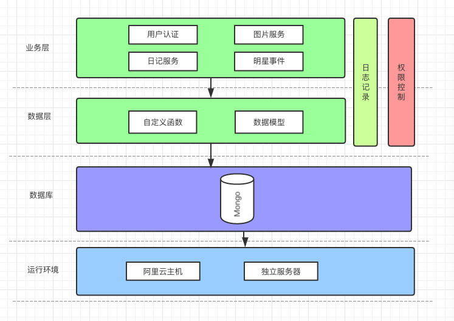
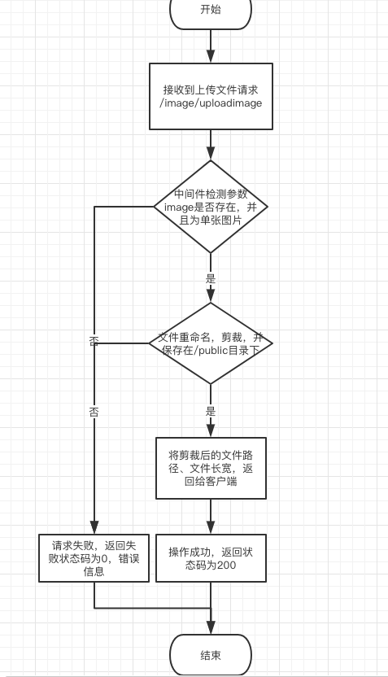
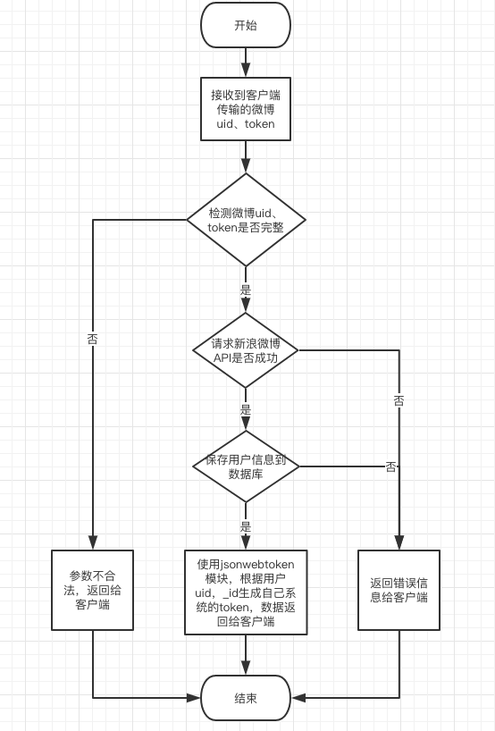
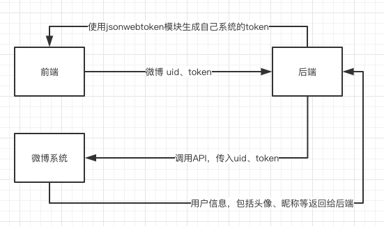

[TOC]

## xl-diary

### 1.使用模块

| 模块名称                | 作用                                       |
| ------------------- | ---------------------------------------- |
| bluebird            | 指定mongoose的Promise，Promise化mongoose.Schema、fs、gm |
| body-parser         | HTTP请求体解析中间件，可以解析 json、Raw、文本、URL-encoded格式的请求体 |
| cookie-parser       | 解析cookie中间件                              |
| file-stream-rotator | 生成日志文件时使用，按每日日期生成文件                      |
| gm                  | 图片处理模块，模块内使用imagemagick、graphicsmagick。用于图片放大和缩小 |
| is_js               | 检验参数类型、正则、字符串、计算、对象时间等                   |
| jsonwebtoken        | JSON Web Tokens的一种实践，token的另外一中变现形式      |
| mongoose            | mongo ORM框架                              |
| morgan              | 日志中间件                                    |
| mount-controllers   | 引入`${workspace}/app/controllers`所有文件     |
| mount-middlewares   | 引入`${workspace}/app/middlewares`所有文件     |
| mount-models        | 引入`${workspace}/app/models`所有文件          |
| multer              | 只用于处理 `multipart/form-data` 类型的表单数据, 它主要用于上传文件 |
| request-promise     | 向其他服务器发送请求，调用微博API                       |

### 2.目录结构

```
├─ app/                        —> 源码目录
│   ├─ controllers/            —> 接收数据，经过处理返回数据
│   ├─ middlewares/            —> 中间件，参数检验、权限判定等
│   ├─ models/                 —> mongoose数据模型
│   ├─ routes/                 —> 路由目录
|   ├─ utils/                  —> 工具类目录
├─ bin/                        —> 项目启动文件
├─ config/                     —> 环境配置文件，分开发、测试、生产环境
├─ logs/                       —> 请求日志目录，每天生成一个对应日期的文件
├─ public/                     —> 静态资源目录，存放上传的图片/image/upload
├─ .gitignore                  —> （配置）需被 Git 忽略的文件（夹）
├─ app.js                      —> 项目入口文件，请求体解析，日志配置，路由分发，错误处理等
├─ mongodb.js                  —> mongodb连接配置
├─ package.json                —> 项目介绍，启动配置，依赖包等
├─ test.js                     —> 测试
```

### 3.系统架构



### 4.流程图

#### 上传文件



#### 用户认证




**非流程图**



[八幅漫画理解使用JSON Web Token设计单点登录系统](http://blog.leapoahead.com/2015/09/07/user-authentication-with-jwt/)

[JSON Web Token - 在Web应用间安全地传递信息](http://blog.leapoahead.com/2015/09/06/understanding-jwt/)

