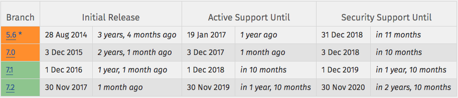

[TOC]


> 参考 [Laravel 项目开发规范](https://fsdhub.com/books/laravel-specification)

# 一. 前言

## 1.1 说明

参照 [优帆远扬](https://laravel-china.org/topics/3626/laravel-remote-and-its-sails-and-freedom#%E4%BC%98%E5%B8%86%E8%BF%9C%E6%89%AC) 团队内部 Laravel 工程师践行的开发规范

# 二. 项目规范

## 2.1 Laravel版本选择

以下是 [Laravel 的版本路线图](https://laravel-china.org/articles/2594/laravel-release-roadmap)：

| 版本          | 发布日期        | 版本类型     | 维护周期                                |
| ----------- | ----------- | -------- | ----------------------------------- |
| Laravel 5.1 | 2015 年 6 月  | LTS 长久支持 | Bug 修复 2017 年 6 月份，安全修复 2018 年 6 月份 |
| Laravel 5.2 | 2015 年 12 月 | 一般发行     | 提供 6 个月的 Bug 修复支持，一年的安全修复支持         |
| Laravel 5.3 | 2016 年 8 月  | 一般发行     | 提供 6 个月的 Bug 修复支持，一年的安全修复支持         |
| Laravel 5.4 | 2017 年 1 月  | 一般发行     | 提供 6 个月的 Bug 修复支持，一年的安全修复支持         |
| Laravel 5.5 | 2017 年 8 月  | LTS 长久支持 | Bug 修复 2019 年 8 月份，安全修复 2020 年 8 月份 |

选择 Laravel 版本时，**应该** 优先考虑 LTS 版本，因为安全性和稳定性考虑，商业项目开发中 **不应该** 使用最新版本的 『Laravel 一般发行版』 。扩展阅读：[如何选择 Laravel 框架版本](https://laravel-china.org/topics/2595/how-to-select-the-laravel-framework-version)。

请使用以下命令来创建指定版本的 Laravel 项目：

```shell
composer create-project laravel/laravel project-name --prefer-dist "5.5.*"
```

## 2.2 开发和线上环境

### 环境说明

一般情况下分为三种：

* Local  - 开发环境
* Staging - 线上测试环境
* Production - 线上生产环境

### 软件使用

**PHP 7**

PHP 版本 **应该** 优先考虑 PHP 7，不止因为其运行高效，还因为随着 PHP 7 的广泛应用，PHP 7 以下的版本将会很快停止维护。

[7.0还是7.1]()

**MySQL 5.7**

数据库软件 **应该** 优先选择 MySQL，因为其使用率最高。MySQL 5.7 与 PHP 7 一样，已经是大势所趋，选择版本时 **应该** 优先考虑 MySQL 5.7。

**其他软件**

优先选择 **流行** **稳定** 版本。线上环境 **绝不** 使用 Beta 或者其他不稳定发行版。

## 2.3 开发专用扩展包

如果在项目中用到开发环境中专用的扩展包，生产环境中并不会使用到，为了避免无用的负载， 必须严格控制其安装和加载。

扩展包固定版本！

**安装**

安装时需要必须添加 `--dev` 参数，如

```shell
composer require laracasts/generators --dev
```

**加载**

开发专用的 provider `绝不`在 `config/app.php` 里面注册，`必须` 在 `app/Providers/AppServiceProvider.php` 文件中使用如以下方式：

```php
public function register()
{
    if ($this->app->environment() == 'local') {
        $this->app->register('Laracasts\Generators\GeneratorsServiceProvider');
    }
}
```

## 2.4 配置信息与环境变量

开发环境 Homestead！

假如我们有个『CDN 域名』的变量，在 Laravel 中有以下几种方法：

1. 硬代码，直接写死。- ❌ 可维护性低
2. 写死在 `config/app.php` 文件中。 - ❌ 无法区分环境进行配置
3. 存储于 `.env` 文件中，使用 `env()` 方法直接读取。 - ❌ 虽然解决了环境变量问题但是不推荐
4. 存储在 `.env` 和 `config/app.php` 文件中，然后使用 `config()` 函数来读取。- ✅ 最佳实践

### 代码示例

`.env` 文件中设置：

```
CDN_DOMAIN=cdndomain.com
```

`config/app.php` 文件中设置：

```
'cdn_domain' => env('CDN_DOMAIN', null),
```

程序中两种获取 `相同配置` 的方法：

1. `env('CDN_DOMAIN')`
2. `config('app.cdn_domain')`

在此统一规定：所有程序配置信息 **必须** 通过 `config()` 来读取，所有的 `.env` 配置信息 **必须** 通过 `config()` 来读取，**绝不** 在配置文件以外的范围使用 `env()`。

### 为什么

1. 定义分明，`config()` 是配置信息，`env()` 只是用来区分不同环境；
2. 代码健壮性， `config()` 在 `env()` 之上多出来一个抽象层，会使代码更加健壮，更加灵活。

## 2.5 辅助函数

Laravel 提供了很多 [辅助函数](http://d.laravel-china.org/docs/5.5/helpers)，有时候我们也需要创建自己的辅助函数。

**必须** 把所有的『自定义辅助函数』存放于 `bootstrap/tools` 文件夹中。

并在 `bootstrap/app.php` 文件的最顶部进行加载：

```php
<?php

require __DIR__ . '/tools/functions.php';

...
```


## 2.6 项目文档编写规范

每一个项目都 **必须** 包含一个 `readme.md` 文件，`readme` 里书写这个项目的简单信息。

作用主要有两个：

1. 团队新成员可从此文件中快速获悉项目大致情况

2. 部署项目时可以作为参考

   ​

文档页面排版 **必须** 遵循 [中文文案排版指北](https://github.com/sparanoid/chinese-copywriting-guidelines) ，在此基础上。

范例见 [附录：readme-example.md](https://fsdhub.com/books/laravel-specification/523/readme-examplemd)

# 三. 编码规范

## 3.1 代码风格

代码风格 **必须** 严格遵循 [PSR-2](http://www.php-fig.org/psr/psr-2/) 规范。

[PhpStorm设置PSR-2代码规范](http://laraveldaily.com/how-to-configure-phpstorm-for-psr-2/)，具体操作如下：

```operate
Preferences -> Editor -> Code style[PHP] -> Set From -> Predefined Style[PSR1/PSR2]
```

## 3.2 路由器

**路由闭包：**

**绝不** 在路由配置文件里书写『闭包路由』或者其他业务逻辑代码，因为一旦使用将无法使用 [路由缓存](http://d.laravel-china.org/docs/5.5/controllers#route-caching) 。

路由器要保持干净整洁，**绝不** 放置除路由配置以外的其他程序逻辑。

**路由命名：**

**必须** 优先使用 Restful 路由，配合资源控制器使用，见 [文档](http://d.laravel-china.org/docs/5.5/controllers#RESTful-%E8%B5%84%E6%BA%90%E6%8E%A7%E5%88%B6%E5%99%A8)。

**GET 请求路由命名**

以获取用户信息接口为例，有两种方式：

`GET <domain>/api/app/user/info/{userId}` 

或者

`GET <domain>/api/app/user/info?userId={userId}`

**必须** 使用第二种方式命名，这样参数明确，错误排查方便

## 3.3 数据模型

**位置：**

所有的数据模型文件，都 **必须** 存放在：`app/Models/` 文件夹中。

命名空间：

```php
namespace App\Models;
```

**使用基类：**

所有的 **Eloquent 数据模型** 都 **必须** 继承统一的基类 `App/Models/Model`，此基类存放位置为 `/app/Models/Model.php`，内容参考以下：

```php
<?php

namespace App\Models;

use Illuminate\Database\Eloquent\Model as EloquentModel;

class Model extends EloquentModel
{
    public function scopeRecent($query)
    {
        return $query->orderBy('created_at', 'desc');
    }
}
```

以 Photo 数据模型作为例子继承 Model 基类：

```php
<?php

namespace App\Models;

class Photo extends Model
{
    protected $fillable = ['id', 'user_id'];

    public function user()
    {
        return $this->belongsTo(User::class);
    }
}
```

> 直接使用框架自带的命令 `php artisan make:model ModelName` 即可
>
> 或者使用 项目自定义命令 `php artisan mtime:model [ModelName]`

**关于SQL文件：**

- **绝不** 使用命令行或者 PHPMyAdmin 直接创建索引或表。**必须** 使用 [数据库迁移](http://laravel-china.org/docs/5.5/migrations) 去创建表结构，并提交版本控制器中；
- **绝不** 为了共享对数据库更改就直接导出 SQL，所有修改都 **必须** 使用 [数据库迁移](http://laravel-china.org/docs/5.5/migrations) ，并提交版本控制器中；
- **绝不** 直接向数据库手动写入伪造的测试数据。**必须** 使用 [数据填充](http://laravel-china.org/docs/5.5/seeding) 来插入假数据，并提交版本控制器中。

## 3.4 控制器

**必须** 使用资源的复数形式，如：

> - 类名：PhotosController
> - 文件名：PhotosController.php

类名文件名，相同

## 3.5 视图

可能暂时 不会用

如果用到，后面再增加

## 3.6 参数验证

参考 [Laravel 5.5 参数验证](https://d.laravel-china.org/docs/5.5/validation#using-rule-objects)

## 3.7 数据填充

**factory 辅助函数：**

`必须` 使用 `factory` 方法来做数据填充，因为是框架提倡的，并且可以同时为测试代码服务。

**运行效率：**

开发数据填充时，`必须` 特别注意 `php artisan db:seed` 的运行效率，否则随着项目的代码量越来越大，`db:seed` 的运行时间会变得越来越长，有些项目多达几分钟甚至几十分钟。

原则是：

> Keep it lighting speed.

只有当 `db:seed` 运行起来很快的时候，才能完全利用数据填充工具带来的便利，而不是累赘。

**批量入库：**

所有假数据入库操作，都 **必须** 是批量操作，配合 `factory` 使用以下方法：

```php
$users = factory(User::class)->times(1000)->make();
User::insert($users->toArray());
```

以上只执行一条数据库语句，推荐阅读 [大批量假数据填充的正确方法](https://laravel-china.org/topics/2066/the-correct-method-for-filling-large-quantity-of-false-data)。

## 3.8 日期和时间

**必须** 使用 [Carbon](https://github.com/briannesbitt/Carbon) 来处理日期和时间相关的操作。

Laravel 5.1 中文的 `diffForHumans` 可以使用 [jenssegers/date](https://github.com/jenssegers/date)。

Laravel 5.3 及以上版本的 `diffForHumans`，只需要在 `config/app.php` 文件中配置 `locale` 选项即可 ：

```php
'locale' => 'zh-CN',
```

## 3.9 Artisan 命令行

所有的自定义命令，都 **必须** 有项目的命名空间。

如：

```Shell
php artisan mtime:clear-token
php artisan mtime:send-status-email
...
```

错误的例子为：

```shell
php artisan clear-token
php artisan send-status-email
...
```

新增命令：

```shell
php artisan mtime:model [ModelName]
php artisan mtime:controller [ModelController]
php artisan mtime:logic [ModelLogic]
```

# 四. 其他

## 4.1 Laravel 安全实践

**关闭DEBUG：**

Laravel Debug 开启时，会暴露很多能被黑客利用的服务器信息，所以，生产环境下请 **必须** 确保：

```php
APP_DEBUG=false
```

**防XSS：**

跨站脚本攻击（cross-site scripting，简称 XSS），具体危害体现在黑客能控制你网站页面，包括使用 JS 盗取 Cookie 等，关于 XSS 的介绍请前往 [IBM 文档库：跨站点脚本攻击深入解析](https://www.ibm.com/developerworks/cn/rational/08/0325_segal/) 。

默认情况下，在无法保证用户提交内容是 100% 安全的情况下，**必须** 使用 Blade 模板引擎的 `{{ $content }}`语法会对用户内容进行转义。

Blade 的 `{!! $content !!}` 语法会直接对内容进行 **非转义** 输出，使用此语法时，**必须** 使用 [HTMLPurifier for Laravel 5](https://github.com/mewebstudio/Purifier) 来为用户输入内容进行过滤。使用方法参见： [使用 HTMLPurifier 来解决 Laravel 5 中的 XSS 跨站脚本攻击安全问题](https://laravel-china.org/articles/4798/the-use-of-htmlpurifier-to-solve-the-xss-xss-attacks-of-security-problems-in-laravel)

**防SQL注入：**

> Laravel 的 [查询构造器](http://d.laravel-china.org/docs/5.3/queries) 和 [Eloquent](http://d.laravel-china.org/docs/5.3/eloquent) 是基于 PHP 的 PDO，PDO 使用 `prepared` 来准备查询语句，保障了安全性。

在使用 `raw()` 来编写复杂查询语句时，**必须** 使用数据绑定。

正确操作，利用 [select 方法](http://d.laravel-china.org/api/5.3/Illuminate/Database/ConnectionInterface.html#method_select) 的第二个参数做数据绑定：

```php
Route::get('sql-injection', function() {
    $name = "admin"; // 假设用户提交
    $password = "xx' OR 1='1"; // // 假设用户提交
    $result = DB::select(
        DB::raw("SELECT * FROM users WHERE name =:name and password = :password"),
        [
            'name' => $name,
            'password' => $password,
        ]
    );
    dd($result);
});
```

`DB` 类里的大部分执行 SQL 的函数都可传参第二个参数 `$bindings` ，详见：[API 文档](http://d.laravel-china.org/api/5.3/Illuminate/Database/ConnectionInterface.html) 。

**批量赋值：**

Laravel 提供白名单和黑名单过滤（`$fillable` 和 `$guarded`），开发者 **应该** 清楚认识批量赋值安全威胁的情况下合理灵活地运用。

批量赋值安全威胁，指的是用户可更新本来不应有权限更新的字段。举例，`users` 表里的 `is_admin` 字段是用来标识用户『是否是管理员』，某不怀好意的用户，更改了『修改个人资料』的表单，增加了一个字段：

```javascript
<input name="is_admin" value="1" />
```

这个时候如果你更新代码如下：

```php
Auth::user()->update(Request::all());
```

此用户将获取到管理员权限。可以有很多种方法来避免这种情况出现，最简单的方法是通过设置 User 模型里的 `$guarded` 字段来避免：

```php
protected $guarded = ['id', 'is_admin'];
```

**CSRF: **

CSRF 跨站请求伪造是 Web 应用中最常见的安全威胁之一，具体请见 [Wiki - 跨站请求伪造](https://zh.wikipedia.org/wiki/%E8%B7%A8%E7%AB%99%E8%AF%B7%E6%B1%82%E4%BC%AA%E9%80%A0) 或者 [Web 应用程序常见漏洞 CSRF 的入侵检测与防范](https://www.ibm.com/developerworks/cn/rational/r-cn-webcsrf/)。

Laravel 默认对所有『非幂等的请求』强制使用 `VerifyCsrfToken` 中间件防护，需要开发者做的，是区分清楚什么时候该使用『非幂等的请求』。

> 幂等请求指的是：'HEAD', 'GET', 'OPTIONS'，既无论你执行多少次重复的操作都不会给资源造成变更。

- 所有删除的动作，**必须** 使用 DELETE 作为请求方法；
- 所有对数据更新的动作，**必须** 使用 POST、PUT 或者 PATCH 请求方法。

## 4.2 Laravel 程序优化

https://fsdhub.com/books/laravel-specification/527/laravel-optimization

# 五. 附录

## 5.1 php7.0 or php7.1

https://www.symfony.fi/entry/php-7-1-vs-7-0-benchmarks-symfony


**从 7.0 到 7.1新特性：**

1. Nullable 类型，可为空类型

   类型现在允许为空，当启用这个特性时，传入的参数或者函数返回的结果要么是给定的类型，要么是 [null](http://php.net/manual/zh/language.types.null.php) 。可以通过在类型前面加上一个问号来使之成为可为空的。

2. Void 函数

   返回值类型允许为 `void`，返回值声明为 `void` 类型的方法要么干脆省去 `return` 语句，要么使用一个空的 `return` 语句。 

   当获取一个 `void` 方法的返回值是，会得到 `null`  ，并且不会有任何警告。

3. 短数组语法

   在 PHP5.4 之前只能通过 `array()` 来定义数组，5.4之后添加了 `[]` 的简化写法

   短数组语法（*[]*）现在可以用于将数组的值赋给一些变量（包括在*foreach*中）。 这种方式使从数组中提取值变得更为容易。

   ```php
   <?php
   $data = [
       ['id' => 1, 'name' => 'Tom'],
       ['id' => 2, 'name' => 'Fred'],
   ];

   while (['id' => $id, 'name' => $name] = $data) {
       // logic here with $id and $name
   }
   ```

4. 类常量可见性

   这个特性说起来比较简单，就是现在类中的常量支持使用 `public`、`private` 和 `protected` 修饰了。

   此外，接口（interface）中的常量只能是 `public` 属性

5. 多条件 catch 

   新的实现中可以在一个 `catch` 中设置多个条件，相当于或的形式判断：

   ```php
   <?php
   try {
       // Some code...
   } catch (ExceptionType1 | ExceptionType2 $e) {
       // 对于 ExceptionType1 和 ExceptionType2 的处理
   } catch (\Exception $e) {
       // ...
   }
   ```

6. 支持为负的字符串偏移量

   一个负数的偏移量会被理解为一个从字符串结尾开始的偏移量。

   ```php
   <?php
   var_dump("abcdef"[-2]);
   var_dump(strpos("aabbcc", "b", -3));

   // 输出：
   // string (1) "e"
   // int(3) 
   ```

   ​

参考：http://php.net/supported-versions.php

Php 各个版本的支持：   