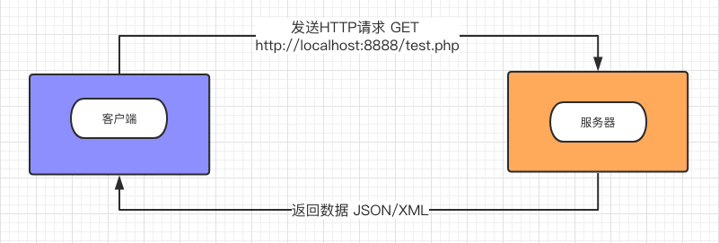

[TOC]

## php开发app接口

### app接口定义：

1.地址：URL

2.文件：处理接口逻辑

3.数据：返回给客户端的数据，json/xml

> 风格：**RESTfull API**，目前一种比较成熟的api设计理念，也可以叫一种规范
>
> - 每一个URI代表一种资源
>
>   它可以是一段文本、一张图片、一首歌曲、一种服务，因为"资源"表示一种实体，所以应该是名词，URI不应该有动词，动词应该放在HTTP方法中
>
> - 使用HTTP方法，对服务器的资源进行操作
>
>   HTTP GET/PUT/POST/DELETE
>
> - 服务器与客户端之间传递某资源的一个表现形式
>
>   JSON，XML传输文本，或者用JPG，WebP传输图片等
>
> - 用[HTTP Status Code](https://www.w3.org/Protocols/rfc2616/rfc2616-sec10.html)传递Server的状态信息
>
>   最常用的 200 表示成功，500 表示Server内部错误
>
> 最主要的是解放思想，Web端不再用之前典型的PHP或JSP架构，而是改为前段渲染和附带处理简单的商务逻辑。
> Web端和Server只使用上述定义的API来传递数据和改变数据状态。格式一般是JSON/XML。iOS和Android也相同。由此可见，Web，iOS，Android和第三方开发者变为平等的角色通过一套API来共同消费Server提供的服务。

### 与app如何通信

client端（APP、前端） => server端 ===>（返回数据，json/xml）client端


**xml**

Extensible Markup Language，扩展标记语言，用来标记数据、定义数据类型，允许用户对自己的标记语言进行定义的源语言。意思是：xml的节点可以自定义的。xml格式统一，跨语言和平台。

```xml
<?xml version="1.0" encoding="UTF-8"?>
<item>
  <title>标题</title>
  <test id="1"/>
  <info>信息</info>
</item>
```

**json**

JavaScript Object Notation 数据交换格式，可在不同平台之间进行数据交换。

```json
{
  "id": 1001,
  "name": "CRAZYFAKE",
  "age": 18,
  "sex": 10,
  "created_at": "1509454044",
  "updated_at": "1509454044"
}
```

区别：

1. 可读性：xml数据方面

2. 生成数据方面：

   **json：** json_encode()函数，传入数组。

   传入浮点数的时候，会有精确度问题，官方文档：

   > http://www.php.net/manual/en/function.json-encode.php
   >
   > The encoding is affected by the supplied `options` and additionally the encoding of float values depends on the value of [serialize_precision](http://php.net/manual/en/ini.core.php#ini.serialize-precision).

   ​

   > http://php.net/manual/en/ini.core.php#ini.serialize-precision
   >
   > The number of significant digits stored while serializing floating point numbers. -1 means that an enhanced algorithm for rounding such numbers will be used.

   意思是序列化浮点数的精度，需要在`php.ini`文件设置`serialize_precision`属性，如果设置成`-1`的话，意味着将使用加强版的四舍五入算法。这样的设置的话，`json_encode`的精度问题就解决。

   **xml：** 手动拼装字符串、DomDocument、XMLWriter、SimpleXML

3. 传输速度：

   json数据量相对要小

### 接口要做什么

#### 获取数据

从数据库、缓存中获取数据，通过接口返回。

#### 提交数据

通过接口，提交数据给服务器，然后服务器处理，存入数据库或者其他操作。

### 封装json/xml数据

通信数据标准格式：

Code: 状态码

Message:提示信息，格式不正确，数据返回成功等

Data:返回数据


​

