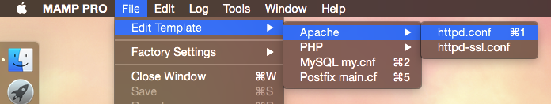

[TOC]

## 清除响应头信息的X-Powered-By

修改`php.ini`文件的`expose_php=Off`

## MAMP开启Apache请求日志

MAMP开启Apache请求日志[参考](https://sites.google.com/site/mamppro/en/mamp/faq/where-can-i-find-the-logs/how-can-i-enable-the-apache-access-logs)：

   1）运行`vim /Applications/MAMP/conf/apache/httpd.conf`

   2）找到`#CustomLog logs/access_log`这一行

   3）修改为`CustomLog "/Applications/MAMP/logs/apache_access.log" combined`

   4）重启Apache服务，`/Applications/MAMP/bin/apache2/bin/apachectl restart`

   5）运行命令`tail -f /Applications/MAMP/logs/apache_access.log`，查看Apache请求日志，如下：

   ```
::1 - - [04/Jun/2010:10:32:20 -0700] "GET /favicon.ico HTTP/1.1" 200 1406 "-" "Mozilla/5.0 (Macintosh; U; Intel Mac OS X 10.5; en-US; rv:1.9.2.3) Gecko/20100401 Firefox/3.6.3 GTB7.0"
   ```

   上面这种方式，是坑爹的，

   因为这样配置会有一个问题，MAMP并不是加载的`/Applications/MAMP/conf/apache/httpd.conf`，如果重启MAMP的话，会造成日志不可用。

   如果永久修改的话[参考](http://blog-en.mamp.info/2015/02/editing-your-httpdconf-file-in-mamp-pro.html)，需要点击`File->Edit Template->Apache->httpd.conf`，如下图[图](http://2.bp.blogspot.com/-QCjkNUlt0EE/VOWcf3R5t4I/AAAAAAAAAd8/J4Q9KD509N8/s1600/Screen%2BShot%2B2015-02-06%2Bat%2B08.07.06.png)：

   

   执行上面的1）~ 3）步，然后重启MAMP，执行第5步

   >  **重点：**
   >
   >  MAMP日志所在位置：`/Applications/MAMP/logs`，包括Apache、Nginx、PHP、MySQL、Cloud

## Navicat连接MAMP连接的MySQL

首先下载Navicat

查看MAMP连接的MySQL所占端口

并修改MAMP的MySQL配置，点击`Allow network access to MySQL`，选择`only from this Mac`

然后配置Navicat连接即可

## PHP 7.1无法使用dd()函数

原因：https://stackoverflow.com/questions/40057476/php-laravel-a-non-well-formed-numeric-value-encountered-on-string

> This is a bug in the symfony/var-dumper package when using PHP7.1. It was fixed in version 2.7.16, 2.8.9, 3.0.9 and 3.1.3. See the pull request: [https://github.com/symfony/symfony/pull/19379](https://github.com/symfony/symfony/pull/19379)
>
> In my case, I needed to `composer update` my laravel framework packages, as my vendor directory copy of that package was at 2.7.9. (I'm using Laravel 5.1; later versions use 2.8 and 3.0 of symfony, which also had the bug)
>
> 项目下执行composer update，或者只更新symfony/var-dumper的版本到` 2.7.16, 2.8.9, 3.0.9 and 3.1.3`就行

## 启动MySQL时，报错：Bind on unix socket: Address already in use

错误信息：

```shell
2017-11-04 10:40:16 5081 [ERROR] Can't start server : Bind on unix socket: Address already in use
2017-11-04 10:40:16 5081 [ERROR] Do you already have another mysqld server running on socket: /Applications/MAMP/tmp/mysql/mysql.sock ?
2017-11-04 10:40:16 5081 [ERROR] Aborting
```

根据上面提示的意思是：`/Applications/MAMP/tmp/mysql/mysql.sock`被占用了

用`ps -ef|grep mysql`检查没有其它MySQL进程

用`netstat -an|grep 8889`检查端口也不存在。

对比正常关闭MySQL时分析，MySQL关闭后`/Applications/MAMP/tmp/mysql/mysql.sock`文件就会被删除，而现在依然存在，猜测上次关闭MySQL时出现了异常，或未正常关闭导致。

**解决办法：**

删除`/Applications/MAMP/tmp/mysql/mysql.sock`文件夹，重启MySQL

## 启动MySQL时，报错：InnoDB: Unable to lock ./ibdata1

错误信息：

```shell
2017-11-06 18:29:28 53754 [ERROR] InnoDB: Unable to lock ./ibdata1, error: 35
2017-11-06 18:29:28 53754 [Note] InnoDB: Check that you do not already have another mysqld process using the same InnoDB data or log files.
```


## 启动MySQL时，报错：InnoDB: Attempted to open a previously opened tablespace. Previous tablespace laravel/migrations uses space ID: 2

错误信息：

```shell
2017-11-06 18:35:27 55599 [ERROR] InnoDB: Attempted to open a previously opened tablespace. Previous tablespace laravel/migrations uses space ID: 2 at filepath: ./laravel/migrations.ibd. Cannot open tablespace mysql/innodb_index_stats which uses space ID: 2 at filepath: ./mysql/innodb_index_stats.ibd
2017-11-06 18:35:27 7fffab2953c0  InnoDB: Operating system error number 2 in a file operation.
InnoDB: The error means the system cannot find the path specified.
InnoDB: If you are installing InnoDB, remember that you must create
InnoDB: directories yourself, InnoDB does not create them.
InnoDB: Error: could not open single-table tablespace file ./mysql/innodb_index_stats.ibd
InnoDB: We do not continue the crash recovery, because the table may become
InnoDB: corrupt if we cannot apply the log records in the InnoDB log to it.
InnoDB: To fix the problem and start mysqld:
InnoDB: 1) If there is a permission problem in the file and mysqld cannot
InnoDB: open the file, you should modify the permissions.
InnoDB: 2) If the table is not needed, or you can restore it from a backup,
InnoDB: then you can remove the .ibd file, and InnoDB will do a normal
InnoDB: crash recovery and ignore that table.
InnoDB: 3) If the file system or the disk is broken, and you cannot remove
InnoDB: the .ibd file, you can set innodb_force_recovery > 0 in my.cnf
InnoDB: and force InnoDB to continue crash recovery here.
```

1.在my.cnf中添加如下参数

在[mysqld]组中加入：

innodb_force_recovery=6

innodb_force_recovery参数解释：

innodb_force_recovery影响整个InnoDB存储引擎的恢复状况，默认值为0，表示当需要恢复时执行所有的恢复操作。

当不能进行有效的恢复操作时，mysql有可能无法启动，并记录下错误日志。

innodb_force_recovery可以设置为1-6,大的数字包含前面所有数字的影响。
当设置参数值大于0后，可以对表进行select,create,drop操作,但insert,update或者delete这类操作是不允许的。
1(SRV_FORCE_IGNORE_CORRUPT):忽略检查到的corrupt页
2(SRV_FORCE_NO_BACKGROUND):阻止主线程的运行，如主线程需要执行full purge操作，会导致crash
3(SRV_FORCE_NO_TRX_UNDO):不执行事务回滚操作。
4(SRV_FORCE_NO_IBUF_MERGE):不执行插入缓冲的合并操作。
5(SRV_FORCE_NO_UNDO_LOG_SCAN):不查看重做日志，InnoDB存储引擎会将未提交的事务视为已提交。
6(SRV_FORCE_NO_LOG_REDO):不执行前滚的操作。

## MAMP安装PHP扩展

此处以`redis`扩展为例

网上寻找`redis.so`扩展包下载，我下载到了`/usr/local/Cellar/php56-redis/3.1.3/redis.so`目录下

然后配置，`php.ini`文件

添加一行代码：

```ini
extension=/usr/local/Cellar/php56-redis/3.1.3/redis.so
```

重启MAMP即可。

**或者：**

对于MAMP4.X版本的用户：

1. `cd /Applications/MAMP/bin/php/php*.*.*/bin`，执行`./pecl install redis`会安装默认版本，或者执行`./pecl install redis-3.1.2`来安装指定版本

2. 打开MAMP pro面板，LANGUAGE-PHP，点击`Manually enable other extensions`，找到对应版本的`php.ini`文件，添加一行：

   ```ini
   extension="redis.so"
   ```

   如果你不是专业版用户的话，编辑`/Applications/MAMP/bin/php/php7.x.x/conf/php.ini`文件即可

3. 重新启动MAMP

>[各种版本的Redis扩展包](https://github.com/CRAZYFAKE/php-redis-mamp)
>
>其他环境的PHP也可以使用这种方式安装扩展


