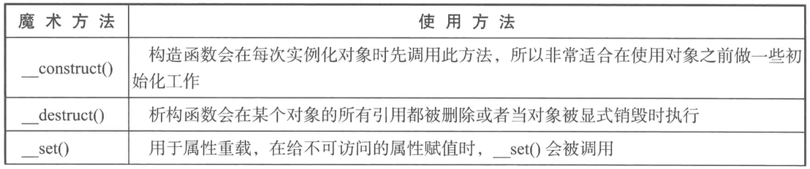
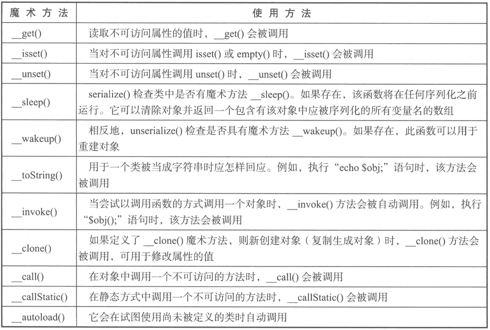
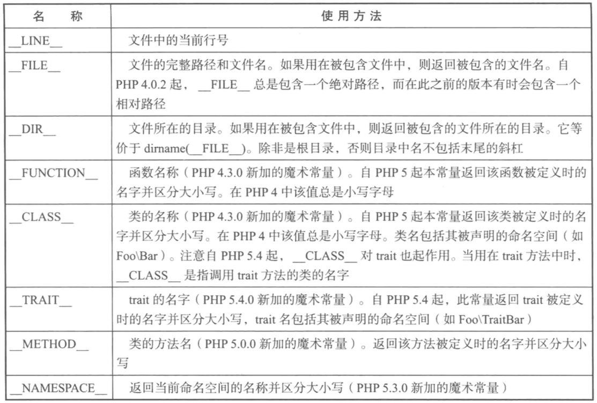

[TOC]


# 基本语法

# 面向对象

## 类

### 构造函数和析构函数

使用方法：

```php
class Construct {
    // 构造函数，可以传参数
	public function __construct($type = 0) {
		echo "构造方法传入参数 \$type => {$type}<br>";
	}
    // 析构函数
	public function __destruct() {
		echo "析构方法";
	}
}
```

手动调用析构函数使用`unset()`方法

## 继承

> 建议使用对象组合，来达到类的扩展性。不能滥用继承，继承不建议超过三层。
>
> 这点得慢慢体会，暂时还没有发现有什么问题

1. 继承子类可以拥有父类除private修饰词修饰的意外的属性和方法（此处涉及到private、public、protected修饰词的权限控制）

2. 函数名相同时，子类会重写父类的方法

3. 构造方法：

   1) 实例化子类，如果子类没有构造方法时，会调用父类的构造方法，如果有构造方法，则调用自己的构造

   2) 子类想调用父类的构造方法时，使用关键字parent

4. `final`关键字

   1) `class`前使用final，则类不能被继承

   2)`function`前使用final，则方法不能被重写


## 抽象类/抽象方法

只要方法被`abstract`修饰的，那么他所在的类也必须被`abstract`修饰

抽象类也可以不包含抽象方法，可以包含普通函数，子类必须把抽象方法实现

```php
abstract class Person {
  public abstract function say();
  public abstract function run();
  
  public function eat() {
    echo "吃东西";
  }
}

// 子类必须把抽象方法实现,而且方法不需要使用abstract修饰
class Student extends Person {
  
  public function say() {
    echo "说话";
  }
  
  public function run() {
    echo "跑";
  }
}
```

1. 含有抽象方法的类一定是抽象类
2. 抽象类不一定含有抽象方法
3. 抽象类中可以有普通的方法
4. 抽象类不能直接实例化，必须由一个子类去继承它，并把父类所有的抽象方法实现（重写）

## 接口

1. 声明关键字interface
2. 接口中可以声明常量和抽象方法
3. 接口中的方法都是抽象方法，不需要使用`abstract`修饰
4. 接口不能实例化，需要一个类去实现它`implements`
5. 一个类可以实现多个接口

### 多态

```php
interface USB {
  public function run();
}

class Mouse implements USB {
  public function run() {
    $this->init();
  }
  
  private function init() {
    echo "Mouse running...";
  }
}

class Store implements USB {
  public function run() {
    $this->init();
  }
  
  private function init() {
    echo "Store running...";
  }
}

class Keyboard implements USB {
  public function run() {
    $this->init();
  }
  
  private function init() {
    echo "Keyboard running...";
  }
}

class Computer {
  
  public function useUSB($obj) {
    $obj->run();
  }
}

$computer = new Computer();
$computer->useUSB(new Mouse());
$computer->useUSB(new Store());
$computer->useUSB(new Keyboard());
```


# 命名空间

1. 同一命名空间下，不能出现重复的类名

2. 类、接口、函数和常量受到命名空间的影响

3. `define()` 为全局常量，不受命名空间影响

4. 使用use导入命名空间下的类

5. 如果导入了不同命名空间下的两个相同名称相同的类，使用别名as，如 

   ```Php
   use vender\Imooc as Imooc2;
   ```

6. 同样可以使用use 导入function和常量

   ```php
   use function vender\session\like;
   use const vender\session\IMOOC;
   ```

7. 如果没有使用namespace指定当前脚本的命名空间的话，当前脚本是全局命名空间的

8. 如何在局部命名空间，调用全局命名空间的类和函数呢？

   - 使用反斜杠`\Test()`，意思是告诉PHP，使用全局作用域下的class Test

   - 如果不加反斜杠()的话

     如果是变量和函数，会首先在当前命名空间下寻找变量和函数的定义，如果没有的话，再去全局命名空间找。

     如果是类的话，会直接在当前命名空间下寻找

## include和require

1. 都是用于包含并运行指定文件，两者作用几乎一样，只是处理失败的方式不同

2. `require`出错是会产生`E_COMPILE_ERROR`级别的错误，会导致脚本程序运行终止

   `include`会产生`E_WARNING`级别的错误，只有警告，不会终止脚本运行

3. ​


# 自动加载

## __autoload()

使用`__autoload()`函数

当当前文件没有Imooc6类时，会执行__autoload函数，传入实例化类的名字Imooc6

但是并不常用。

```php
function __autoload($className) {
	require $className . ".php";
}
```

## spl_autoload_register

```Php
spl_autoload_register(function ($className){
	require $className . ".php";
});

spl_autoload_register(function ($className) {
	include str_replace("\\", "/", $className . ".php");
});
```

# PHP常见关键字

## final

1. 使用final标识的类不能被继承
2. 使用final标识的方法不能被重写

> 目的：
>
> 一是为了安全
>
> 二是没有必要重写或继承

## static

1. 类的属性和方法，不是对象的

2. 不能在static函数 调用非static属性

3. 子类调用父类的static属性或方法：

   使用关键字`parent`

## const

## instanceof

# 魔术方法

1. __get/set    批量设置set、get方法，使用时与赋值操作相同。

2. __isset         检测私有属性是否存在

3. __unset       删除对象私有属性

4. __call           当调用对象的方法不存在时，会产生错误，PHP提供了这个方法来处理这种情况

5. __callStatic 当静态方法不存在时，自动调用，而且该方法必须是static的

6. __invoke     当对象以函数的方式被调用的时候，该方法自动被调用

7. __toString   当打印对象的时候，自动调用该方法

8. __clone        当执行`clone`时自动调用该方法，主要解决对象中特殊属性的复制操作

   对象复制，深拷贝和浅拷贝
   浅拷贝：复制地址，不复制指针，被拷贝对象和拷贝对象的指针指向同一地址。

   ​	       对象的赋值，可以理解为变量之间是值传递的，可就是浅拷贝。

   ​	       普通类型的变量是深拷贝的。

   深拷贝：复制指针。使用关键字clone，但是不会深拷贝多层，只会深拷贝最外层的地址,

   ​	       如果需要多层深拷贝的话，需要使用魔术函数__clone()

9. __sleep/wakeup  序列化和反序列化

   调用`serialize(new Obj())`时，对调用`class Obj`的sleep方法，`unserialize(new Obj())`=>`wakeup()`






#魔术变量



```php
<?php
namespace syntax;

trait TraitA {
	public static function traitName() {
		return "__TRAIT__ => " . __TRAIT__ . "<br>";
	}
}

class magicparam {
	use TraitA;

	public static function getLine() {
		return "__LINE__ => " . __LINE__ . "<br>";
	}

	public static function getFile() {
		return "__FILE__ => " . __FILE__ . "<br>";
	}

	public static function getDir() {
		return "__DIR__ => " . __DIR__ . "<br>";
	}

	public static function getFunction() {
		return "__FUNCTION__ => " . __FUNCTION__ . "<br>";
	}

	public static function getClass() {
		return "__Class__ => " . __Class__ . "<br>";
	}

	public static function getMethod() {
		return "__METHOD__ => " . __METHOD__ . "<br>";
	}

	public static function getNamespace() {
		return "__NAMESPACE__ => " . __NAMESPACE__ . "<br>";
	}

	public static function getTrait() {
		return TraitA::traitName();
	}
}

echo magicparam::getLine();
echo magicparam::getFile();
echo magicparam::getDir();
echo magicparam::getFunction();
echo magicparam::getClass();
echo magicparam::getMethod();
echo magicparam::getNamespace();
echo magicparam::getTrait();
```

输出结果为：

```Php
__LINE__ => 21
__FILE__ => /Users/yaoyixiang/Documents/workspace/MAMP/laravel-pro/public/normal/magicparam.php
__DIR__ => /Users/yaoyixiang/Documents/workspace/MAMP/laravel-pro/public/normal
__FUNCTION__ => getFunction
__Class__ => syntax\magicparam
__METHOD__ => syntax\magicparam::getMethod
__NAMESPACE__ => syntax
__TRAIT__ => syntax\TraitA
```

